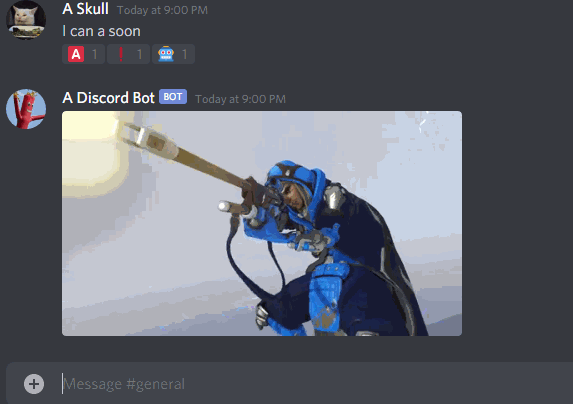
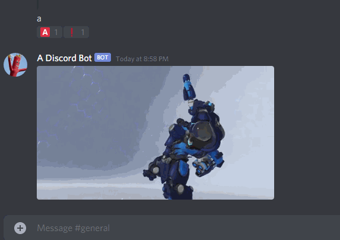

# A Discord Bot
A Discord Bot is a Discord Bot that helps properly react to when a member of a server properly informs the other members of the server that it is time to play [Overwatch](https://playoverwatch.com/en-us/).



## Motivation  

The motivation of this bot was to have a bot that automatically responds with reactions on a message and posts a gif in response to a message containing multiple `a`'s at the end of a message or a message that is only `'a'`. These are both used in a Discord Server I am in to signal to the others that it is time to play Overwatch.

Also I kinda wanted to make a basic Discord Bot for fun.

## Support Me 
Help get me off Heroku free dynos

[](https://www.paypal.com/donate?hosted_button_id=U65R5REYQXAR8)

## Dependencies 

* [discord.py](https://pypi.org/project/discord.py/)
* [giphy_client](https://pypi.org/project/giphy_client/)

#### Dependency Installation 

`pip3 install -r requirements.txt`

## Environment Variables

```
DISCORD_TOKEN: The Bot's Discord Token
GIPHY_TOKEN: The Giphy API Token 
``` 

## How to Run

#### Pre-Requisites
* [A Discord App](https://discord.com/developers/applications) setup as a Bot
    * You'll need the following scopes for OAuth2 
        * `bot`
            * `Send Messages`
            * `Add Reactions`
    * You can install the bot into a Discord Server via the OAuth2 generated URL
        * e.g. `https://discord.com/api/oauth2/authorize?client_id=<1234>&permissions=2112&scope=bot`
        
* [A Giphy API Key](https://developers.giphy.com/)
    * A basic API key is fine, it's only used to call the [Search Endpoint](https://developers.giphy.com/docs/api/endpoint#search)

* [Install the Dependencies](#dependency-installation)
* Set the [Environment Variables](#environment-variables)
    * `export DISCORD_TOKEN=xxxx`
    * `export GIPHY_TOKEN=xxxx` 

#### Running
* `python3 bot.py`

## Example

_This is how we signal to each other that it's time to feed on Overwatch_

## Deployment 

The bot is currently deployed on [Heroku](https://heroku.com/) using free dynos.

The deployment is automated using the [Deploy to Heroku](https://github.com/marketplace/actions/deploy-to-heroku) Action from [AkhileshNS](https://github.com/AkhileshNS).  
